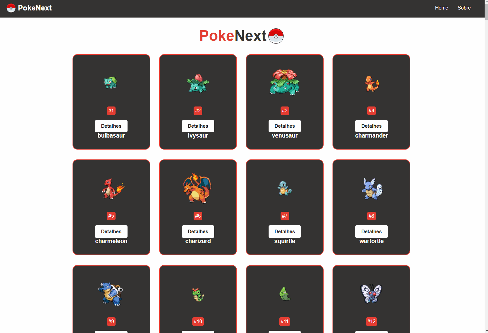
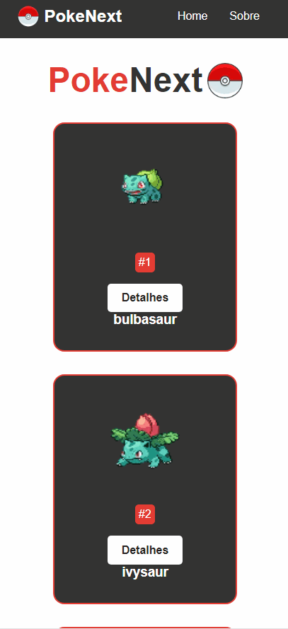

# PokeNext-Js  

🎴 Projeto consumindo uma api de imagem e outra de informações, renderizando tudo em diversos cards de pokemon com todo conteudo sobre cada um como exemplo: nome, poder, característica entre outros conteúdos. 🎴
#
* Deploy Vercel ☁️:
  * [PokeNext](https://pokenext-js-eight.vercel.app/) 
#

* API's Manupuladas no Projeto 🌐:
    * [x] Informações contendo as imagens dos pokemons:
      * [raw.githubusercontent.com](https://raw.githubusercontent.com/PokeAPI/sprites/master/sprites/pokemon/5.png) 🖼️
    * [x] Informações completas baseadas na característica de cada pokemon
       * [pokeapi.co](https://pokeapi.co/api/v2/pokemon/) ℹ️

#

* Stacks 📚 and Skills 🧠:

    * CSS
        * Flex-Box
        * Media Query
    *  JavaScript 
        * DOM
        * Eventos
        * Funções
        * Fetch
    *  Next-Js 
        * JSX
        * Props
        * Rotas
        * Bibliotéca **Image**
          * Utilizada para renderizar imagens no Next-Js
        * next.config.js
          * Configuração deste arquivo para habilitar a  manipulação apis dentro do projeto:
            * ```
               module.exports = {
                reactStrictMode: true,
                images: {
                  remotePatterns: [
                    {
                      protocol: "https",
                      hostname: "**",
                    },
                  ],
                },
              }

#

<div align='center'>
<h3>Page 📑:</h3>
<h4>Pokemon Cards 🎴:</h3>

</div>

#

<div align='center'>
<h3>Responsive Mobile📲:</h3>
<h4>Pokemon Cards 🎴:</h3>

</div>
#

This is a [Next.js](https://nextjs.org/) project bootstrapped with [`create-next-app`](https://github.com/vercel/next.js/tree/canary/packages/create-next-app).

## Getting Started

First, run the development server:

```bash
npm run dev
# or
yarn dev
```

Open [http://localhost:3000](http://localhost:3000) with your browser to see the result.

You can start editing the page by modifying `pages/index.js`. The page auto-updates as you edit the file.

[API routes](https://nextjs.org/docs/api-routes/introduction) can be accessed on [http://localhost:3000/api/hello](http://localhost:3000/api/hello). This endpoint can be edited in `pages/api/hello.js`.

The `pages/api` directory is mapped to `/api/*`. Files in this directory are treated as [API routes](https://nextjs.org/docs/api-routes/introduction) instead of React pages.

## Learn More

To learn more about Next.js, take a look at the following resources:

- [Next.js Documentation](https://nextjs.org/docs) - learn about Next.js features and API.
- [Learn Next.js](https://nextjs.org/learn) - an interactive Next.js tutorial.

You can check out [the Next.js GitHub repository](https://github.com/vercel/next.js/) - your feedback and contributions are welcome!

## Deploy on Vercel

The easiest way to deploy your Next.js app is to use the [Vercel Platform](https://vercel.com/new?utm_medium=default-template&filter=next.js&utm_source=create-next-app&utm_campaign=create-next-app-readme) from the creators of Next.js.

Check out our [Next.js deployment documentation](https://nextjs.org/docs/deployment) for more details.
